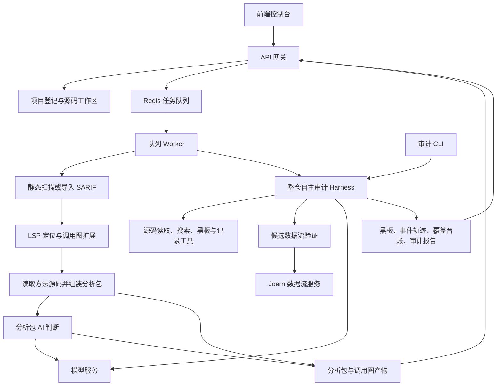
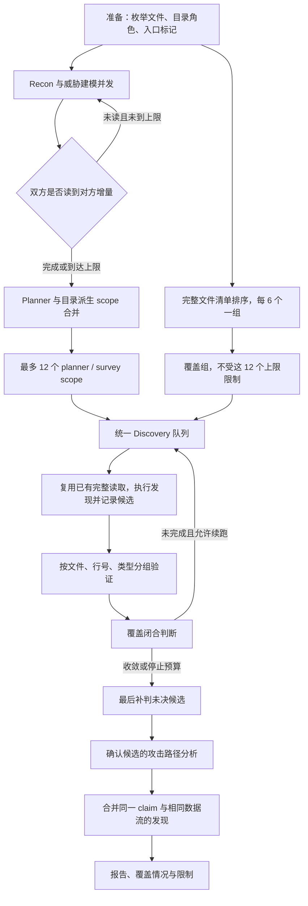
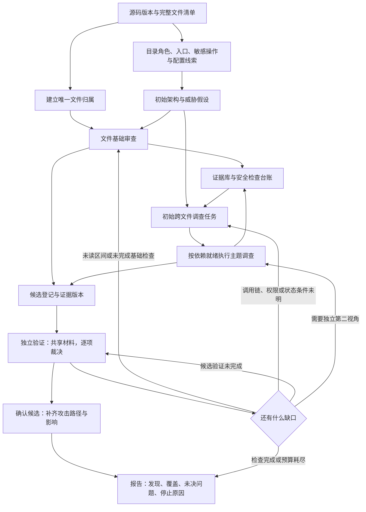

# Aegis 架构与 AI 审计流程优化建议

日期：2026-09-17。依据当前工作区源码进行静态架构走读；工作区包含已有未提交改动，因此本文描述当前工作区，不代表某个已发布版本。没有运行真实付费审计，没有修改运行逻辑。用户提供的运行统计仅作为问题背景，本文没有重新核算其原始日志。

## 1. 总体判断

保留现有服务边界、黑板、工具轨迹、完整读取台账、验证与攻击路径阶段。主要改造发现阶段的工作契约：从“两个 scope 家族反复审查各自文件”转为“单一文件归属 + 可追踪安全检查 + 跨文件问题调查”。

文件完整读取是必要的过程证据，不是漏洞完整发现的证明。任务数量下降也不是质量提升的证明。优化目标是减少重复分析与无目标续跑，同时保留局部检查、跨文件调查和独立第二视角。

## 2. 当前整体结构

README 仍以早期分析包组装阶段为主；实际代码已经有两条不同的 AI 分析路径。不要把整仓审计画成必须先跑静态扫描的单一路径。

这是逻辑关系图，省略了同步接口、故障回退及具体部署传输细节。扫描、提取也有直接接口；队列不是所有调用的唯一入口。

关键实现：

- `services/queue/worker.py::_run` 区分普通扫描/组装、AI_FANOUT 与 AUDIT。
- `services/extraction/pipeline/assemble.py` 承担分析包组装。
- `services/ai/runner.py` 提供模型调用与分析包 AI 路径的能力。
- `services/harness/coordinator.py` 编排自主审计。
- `aegis_contracts/harness.py` 定义黑板、任务、候选、裁决和报告对象。
- `services/harness/react.py` 执行模型—工具循环、预算与输出恢复。
- `services/harness/tools/dataflow.py` 为候选接入数据流证据。

## 3. 当前自主审计流程

实际顺序是 Discovery → Validation → Closure。部分注释仍写“先 closure 后 validation”，分析以执行代码为准。

已经具备、应继续使用的能力：

1. 全量文件归属兜底，且通过真实 read 返回区间计算读取覆盖。
2. 开场的增量发布、水位线与有限补跑。
3. 第 0 轮也支持源码回放，并非只有重派发才复用。
4. 按 `(file, line, vulnerability_type)` 复用验证，不是仅按位置去重。
5. 按材料重叠合批验证和攻击路径分析；默认 `claim_batch_size=1`，代码存在不等于运行已启用。
6. 污点类候选在验证前由编排器尝试数据流验证；工具不可用与没有路径分别记录。
7. 所有发现任务已获得漏洞类别检查、同类实现检查；覆盖组同时获得正向与反向视角。

## 4. 主要结构问题

### 4.1 scope 承担了过多含义

`_scope_files` 同时用于文件归属、任务材料、完整读取义务。目录派生 scope 与覆盖组因此都得到“读完这些文件”的任务。

目录角色应保留为架构标签。真正的调查单位应是“业务操作或资产 × 安全属性”，例如“文件下载 × 对象归属校验”，并能够沿调用关系跨目录调查。

### 4.2 读取台账无法证明检查完成

闭合逻辑主要观察工作项是否 DONE、新位置产出、未读文件和未决候选；没有一份结构化台账说明哪个安全检查完成了、依据是什么、还缺什么。

增加更多提示词不能替代这份台账。建议以入口、敏感操作、配置或业务状态为检查锚点；记录适用性、证据及未解决条件。模型填写的结论仍需证据核查，不能升级为确定性的漏洞完整性证明。

### 4.3 跨 scope 线索存在记录入口，但缺少派发闭环

`CrossScopeLead`、`record(kind="lead")`、`blackboard.add_lead` 已存在。本次检索当前 harness 实现，未看到消费 `blackboard.leads`、自动创建调查任务、追踪领取与完成的调度路径。

更直接的限制是：`agents.py` 注册的 DISCOVERY 工具只有 READ、GREP、LIST_FILES、SHELL，没有 BOARD 和 RECORD。因此发现 agent 本身不能通过这两个结构化工具查询共享检查状态或提交 lead；开场 agent 的黑板协作能力不能直接视为发现阶段已具备。应通过受限工具或结构化任务输出接通，而不是仅修改提示词要求它们协作。

当前 lead ID 由来源 scope、目标 scope 和固定类型生成。同一来源到同一目标的不同线索还可能命中同一个 ID，后续被去重。新设计应使用具体问题、锚点或独立 ID，并为线索保留状态和结果引用。

### 4.4 未完成原因不同，却可能回到同一种 Discovery

`INSUFFICIENT` 包括未读文件、发现足够多新位置、候选尚无裁决等。下一轮从这个状态集合派发 Discovery，因此验证失败可能导致发现任务重跑。

应按缺口类型派发：未读区间回到文件审查；未判候选回到验证；跨文件未知条件进入调查；模型/工具故障进行有界重试。

### 4.5 源码复用省工具回合，不自动省分析

`stored_read` 主要接受单次完整读取，覆盖台账则能合并多个读取区间；分段读完的文件可能覆盖完整却不能回放。`material_budget` 又限制可注入材料的大小。

先区分三种指标：真实读取、源码回放、模型实际收到的源码量。再支持同一源码版本下的区间合并。摘要仅用于检索导航，实际判断应能回到原始代码和证据位置。

### 4.6 还有两个具体调度问题应单独处理

- `max_rounds` 的配置注释称 3 表示总共 3 轮，但循环使用 `range(max(1, max_rounds) + 1)`，默认值允许最多 4 次 Discovery。需要统一名称、文档和执行语义，并测试边界。
- 合批验证路径中，污点候选预取逐组执行，得到路径的单例也逐个调用 `_validation_single`；这一段没有使用后面的批量并发队列。应测量占比，再纳入受控并发。不能仅提高全局并发就假定这里同步加速。

此外，`run()` 的收尾说明固定包含“覆盖率收敛完成”，而实际可能因预算或收益阈值停止。应区分运行结束、检查完成与探索预算用尽，避免界面文案掩盖已有未完成记录。

## 5. 建议的目标流程

图中的队列可以交错运行，不要求所有覆盖组完成后才调查。材料就绪的调查即可启动；必须给基础审查保留执行机会，防止长链调查耗尽所有资源。第一阶段可以继续使用现有轮次框架，先改变任务内容与完成条件；成熟后再移除全局轮次屏障。

### 5.1 文件组负责什么

完整读取归属文件，执行适用的基础检查，记录入口、敏感操作、控制条件、候选与未决问题。发现局部漏洞可以直接登记；小范围跨文件补证可以继续，较长调查形成有负责人的任务。文件归属不限制必要的跨文件读取。

先保留六文件分组，降低迁移变量；之后按源码体积和复杂程度平衡批次。大文件可按方法拆成子任务，但必须保留文件级完整归属以及顶层初始化、声明、配置等剩余区间的检查义务。

### 5.2 主题任务如何生成

来源包括威胁模型、基础审查的未决问题、已识别的敏感操作、同类实现差异和探索性复查。不能只调查文件组已经发现的候选，否则会丢掉主题独立发现能力。

建议模板：

| 对象 | 安全属性 | 典型问题 |
| --- | --- | --- |
| 登录与会话 | 身份绑定 | 身份在签发、校验、使用时是否一致 |
| 文件下载、订单读取 | 对象授权 | 当前主体能否访问当前租户或用户的对象 |
| 出站 HTTP 请求 | 网络目标限制 | 输入、重定向、配置如何影响最终目标 |
| 上传、解压、落盘 | 存储边界 | 写入路径和后续使用是否越界 |
| 查询、模板、命令 | 数据与指令边界 | 不可信数据是否进入解释执行位置 |
| 订单、支付、后台处理 | 状态与一致性 | 是否跳步、重放、重复执行或出现竞争 |

这些是模板，不是每仓固定创建六个 agent。每项任务须有具体锚点、问题、证据要求、完成条件与预算。保留少量不受预设类别限制的第二视角调查，并对高风险控制做独立核查，避免共享摘要造成共同盲点。

### 5.3 最小数据模型扩展

- `FileReview`：源码版本、文件/区间、唯一负责人、读取证据、基础检查、未决问题。
- `ReviewCheck`：锚点、安全属性、适用依据、状态、证据引用、结果与局限。
- `InvestigationTask`：具体问题、起始锚点、所需材料、依赖、状态、预算、结果引用。
- `EvidenceRef`：源码版本、路径、区间、工具来源；区分原始证据与模型摘要。
- `Claim`：候选实例来源、入口/控制条件、证据版本与验证状态。

优先扩展现有黑板与契约，暂不新建独立服务。ReviewCheck 采用 `pending/running/checked/not_applicable/unresolved` 一类检查状态；发现漏洞与是否完成检查分别记录。

### 5.4 候选去重与裁决复用

保留当前 `(file,line,type)` 作为聚合索引，但不要把它当成不随证据变化的最终身份。相同位置和类型新增了无鉴权入口、不同调用链或控制条件时，应更新证据版本并重新验证受影响的判断；仅重复提交同样证据时复用原结论。

验证材料允许合批，每条 claim 保留独立结论。攻击路径阶段复用验证已建立的事实，仅补入口可达性、攻击前提和影响；不要求完整重做同一条推理。

## 6. 分步落地

| 顺序 | 改动 | 涉及模块 | 验收重点 |
| --- | --- | --- | --- |
| P0 | 补齐耗时、token、真实读取/回放、任务停止原因指标；统一轮次语义与收尾文案 | coordinator、trail、report、前端 | 能解释每次续跑为什么发生；结束不冒充全部检查完成 |
| P1 | Discovery 结构化共享与 lead 提交；lead 可靠入队和完成闭环；不同问题不误去重；验证失败只补验证 | contracts、agents、blackboard、coordinator | 未决线索不会因目标 scope 已结束而消失；不引起整组重查 |
| P1 | 分段读取可复用、验证单例受控并发 | agents、material、coordinator | 无错误源码版本复用、无并发超额、证据归属正确 |
| P2 | 增加检查台账；基础审查产出结构化证据 | contracts、agents、coverage、report | 文件读完与安全检查完成分别可见 |
| P2 | planner 生成问题任务，主题不再重复拥有文件 | survey、agents、coordinator | 主题仍可主动发现问题，必要跨文件追踪不受目录阻断 |
| P3 | 按依赖调度、平衡工作量、差异化探索预算 | coordinator、coverage | 降低等待与无目标重跑，基础覆盖不被饿死 |

建议一次只改变一组机制，并保留旧流程切换做对照。优先 P0/P1，不立即删除主题任务，也不预先承诺 42 个任务必定变成 30 个。

## 7. 质量与成本验证

固定源码快照、模型、提示词版本、并发、token 与工具配置，记录实际使用值。先用已有小型 fixture 验证调度和证据不变量，再在 21 文件子树与 177 文件模块做对照；条件允许时重复运行，避免把模型波动当成架构收益。

必须验证：

1. 文件清单并集等于分配清单，每个文件恰好一个基础审查负责人；无法读取或有意排除的文件可见。
2. 分段/超大文件、工具失败和预算耗尽不被记成完整检查。
3. 跨文件线索即使指向已结束任务也有后续处理；同一对 scope 的多个不同问题均保留。
4. 验证失败不触发不必要的 Discovery；新增实质证据不会继承过时裁决。
5. 批量验证每个 claim 都有独立输出，遗漏项保持待办，数据流证据不串用。
6. 全局停止后仍报告未读文件、未决检查、未判候选与探索停止原因。

质量指标以已验证漏洞、已知基准漏洞及关键跨文件路径为准；双方独有候选数量是分析线索，不能直接当成真实漏洞召回。基线自身也可能漏检，因此“保留基线所有结果”不能等同于无遗漏。

成本指标包括：端到端耗时、分阶段模型调用和输入/输出 token、工具调用、回放命中率、队列等待、重复调查以及无新证据续跑次数。不用单一“读取次数下降”宣称成本改善。

## 8. 实施边界

本方案不会保证漏洞零遗漏。它把当前比较难解释的重复审查，变成有对象、有问题、有证据、有结束条件的工作，并让剩余缺口可见。

本次仅新增架构评审文档；没有改变运行配置、模型提示词或调度逻辑，也没有执行付费模型调用。上面的缺口是源码静态观察，具体耗时占比和质量影响需要对照运行验证。
