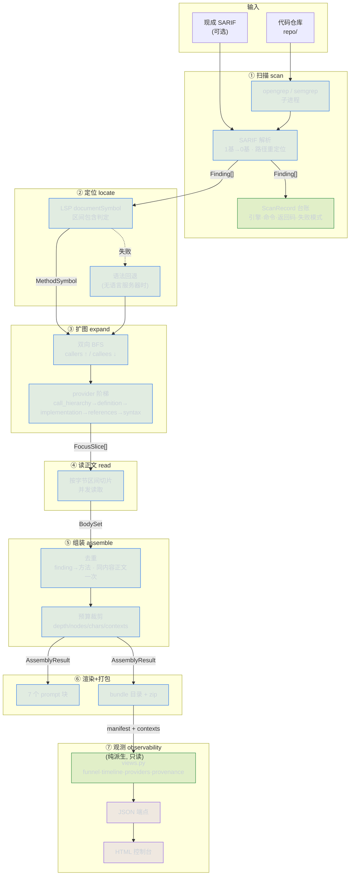
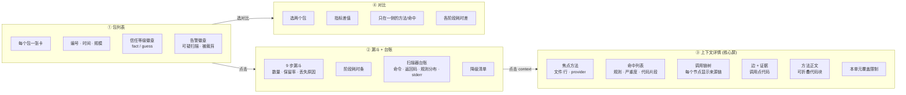

# Aegis 数据流与前端原型图

## 一、数据流（Mermaid —— GitHub / VS Code / Typora 的 Markdown 预览可直接渲染）



### 各阶段的数据流量（一次真实运行，Python 夹具）

| 阶段 | 输入量 | 输出量 | 丢了多少 | 耗时 |
|---|---|---|---|---|
| ① scan | 4 个 .py | 1 个 Finding | 0 | 1 ms |
| ② locate | 1 Finding | 1 个方法 `query_user` | 0 | 306 ms |
| ③ expand | 1 个焦点 | 4 个方法 + 3 条边 | 0（深度截断 1 处） | 429 ms |
| ④ read | 4 个方法 | 399 字符正文 | 0 | 2 ms |
| ⑤ assemble | — | 1 个 context，去重 0 | 0 | 0 ms |
| ⑥ render+package | — | 13 个文件，1779 tokens | — | — |

---

## 二、前端信息架构（建议四屏）



---

## 三、核心屏 ASCII 原型

这是最重要的那一屏——**一个分析单元的完整解释**。当前控制台已有全部数据，但都用表格平铺，没有层级。

```
┌──────────────────────────────────────────────────────────────────────────────┐
│  Aegis  B-c7f830954f        run R-c592ccc1bf        2026-09-11 08:24         │
│  ┌────────┐ ┌───────────────────┐ ┌─────────────┐ ┌──────────────────┐       │
│  │1 上下文│ │4 方法 / 3 条边    │ │~1779 tokens │ │裁剪 1 · 降级 0   │       │
│  └────────┘ └───────────────────┘ └─────────────┘ └──────────────────┘       │
│                              [下载 zip] [graph.dot] [原始 SARIF]              │
├──────────────────────────────────────────────────────────────────────────────┤
│                                                                              │
│  ● 焦点方法                                                                  │
│    query_user                     repo.py:4-11        ┌──────────────────┐   │
│    由 documentSymbol 定位                             │ trust: fact      │   │
│                                                       │ conf: 1.00       │   │
│                                                       └──────────────────┘   │
│                                                                              │
│  ● 静态扫描命中                                                    严重度 ●  │
│    ┌────────────────────────────────────────────────────────────────────┐   │
│    │ F-8385d9903e16   python.lang.security.sql-injection         ERROR  │   │
│    │ repo.py:5    sql = "SELECT * FROM users WHERE id = '" + user_id…"  │   │
│    └────────────────────────────────────────────────────────────────────┘   │
│                                                                              │
│  ● 调用链（箭头 = 方向，右侧 = 证据）                                        │
│                                                                              │
│    ↓ 被调用  d1   connect          repo.py:11-15      ┌─────────────────┐    │
│       ▲ 来源: query_user → connect                    │ call_hierarchy  │    │
│       ▲ 证据: cursor = connect()                      │ conf 1.00       │    │
│                                                       └─────────────────┘    │
│    ↑ 调用者  d1   load_user        service.py:6-10    ┌─────────────────┐    │
│       ▲ 来源: query_user → load_user                  │ call_hierarchy  │    │
│       ▲ 证据: return query_user(user_id)              │ conf 1.00       │    │
│                                                       └─────────────────┘    │
│    ↑ 调用者  d2   handle_request   handler.py:9-15    ┌─────────────────┐    │
│       ▲ 来源: query_user → load_user → handle_request │ call_hierarchy  │    │
│       ▲ 证据: return load_user(name)                  │ conf 1.00       │    │
│                                                       ⚠ 到此被 max_depth 截断│
│                                                                              │
│  ● 方法正文                                           [全部展开] [全部折叠]  │
│                                                                              │
│    ▼ M-568641cc8bfb  query_user        repo.py:4-11      ★ FOCUS             │
│    ┌────────────────────────────────────────────────────────────────────┐   │
│    │ def query_user(user_id):                                           │   │
│    │     cursor = connect()                                             │   │
│    │     sql = "SELECT * FROM users WHERE id = '" + user_id + "'"   ←── 命中
│    │     cursor.execute(sql)                                            │   │
│    │     return cursor                                                  │   │
│    └────────────────────────────────────────────────────────────────────┘   │
│                                                                              │
│    ▶ M-61de505c2db2  connect           repo.py:11-15                         │
│    ▶ M-d7bc9ab449d6  load_user         service.py:6-10                       │
│    ▶ M-37ded04827c0  handle_request    handler.py:9-15                       │
│                                                                              │
│  ⚠ 本单元覆盖限制                                                            │
│    max_depth  调用链在深度 2 停止（上限 2）  handler.py:9                     │
│                                                                              │
└──────────────────────────────────────────────────────────────────────────────┘
```

### 相对现在控制台的关键改动

| 现在 | 原型 | 为什么 |
|---|---|---|
| 方法列表平铺成表格 | **调用链树**，箭头显示方向 | 现在要自己读 depth/direction 才明白谁调谁 |
| 来源链是一行 `M-xxx → M-yyy` | 来源链写成**方法名** | 现在满屏 `M-568641cc8bfb`，读不动 |
| 证据单独一个表格 | 证据**贴在对应节点右侧** | 现在要左右对照着看 |
| 正文在另一个文件（要下载） | 正文**内联可折叠**，命中行高亮 | 现在看正文要开 `methods/*.txt` |
| 裁剪原因在最后 | 裁剪原因**挂在被截断的节点上** | 现在要知道"为什么这里是尽头"得往下翻 |

---

## 四、包列表屏原型

```
┌──────────────────────────────────────────────────────────────────────────────┐
│  Aegis  ·  pipeline observability          scanner opengrep 1.16.0   [刷新]  │
├──────────────────────────────────────────────────────────────────────────────┤
│  筛选: [全部] [有降级] [被裁剪] [可疑扫描]            排序: [时间▾]           │
├──────────────────────────────────────────────────────────────────────────────┤
│ ┌──────────────────────────────────────────────────────────────────────────┐ │
│ │ B-c7f830954f                                    2026-09-11 08:24  [打开] │ │
│ │ 1 上下文 · 4 方法 · 1/1 命中 · ~1779 tokens · 740 ms                     │ │
│ │ [fact×4]                                         [裁剪 1]                │ │
│ └──────────────────────────────────────────────────────────────────────────┘ │
│ ┌──────────────────────────────────────────────────────────────────────────┐ │
│ │ B-console-demo                                  2026-09-11 03:47  [打开] │ │
│ │ 1 上下文 · 4 方法 · 1/1 命中 · ~1865 tokens · 1103 ms                    │ │
│ │ [fact×4]                                                                 │ │
│ └──────────────────────────────────────────────────────────────────────────┘ │
│ ┌──────────────────────────────────────────────────────────────────────────┐ │
│ │ B-failed-scan                                   2026-09-11 03:40  [打开] │ │
│ │ 0 上下文 · 0 方法 · 0/0 命中 · ~990 tokens · 32 ms                       │ │
│ │ [guess×0]  ⚠ 扫描器失败: rc=2 unknown option '--nope'                    │ │
│ └──────────────────────────────────────────────────────────────────────────┘ │
└──────────────────────────────────────────────────────────────────────────────┘
```

**可信度用颜色区分**：`[fact]` 绿、`[strong]` 蓝、`[weak]` 黄、`[guess]` 橙。扫一眼列表就知道哪个包基于真实语言服务器、哪个是猜的。

---

## 五、漏斗屏原型

```
┌──────────────────────────────────────────────────────────────────────────────┐
│  B-c7f830954f  ·  漏斗                                                       │
├──────────────────────────────────────────────────────────────────────────────┤
│  扫描器命中                        ███████████████████████████████████  1     │
│  定位到所属方法                    ███████████████████████████████████  1 100%│
│  承载命中的不同方法                ███████████████████████████████████  1 100%│
│  构建的上下文                      ███████████████████████████████████  1 100%│
│  展开的调用链切片                  ███████████████████████████████████  1 100%│
│  走图提出的方法(毛)                ███████████████████████████████████  4 100%│
│  保留在包里的方法(净)              ███████████████████████████████████  4 100%│
│  读取到的方法正文                  ███████████████████████████████████  4 100%│
│  真正内联进上下文的                ███████████████████████████████████  4 100%│
├──────────────────────────────────────────────────────────────────────────────┤
│  阶段耗时                                                                    │
│  expand  调用图展开        ████████████████████████████  429 ms   58.1%      │
│  locate  定位方法          ███████████████████████       306 ms   41.4%      │
│  read    读取正文          █                              2 ms    0.3%      │
│  scan    静态扫描          █                              1 ms    0.1%      │
├──────────────────────────────────────────────────────────────────────────────┤
│  扫描器台账                                                                  │
│  engine    sarif-input          exit code  0                                │
│  rules     explicit             suspicious false                            │
│  rule hits python.lang.security.sql-injection ×1                            │
│  severity  error ×1             hot files repo.py ×1                        │
└──────────────────────────────────────────────────────────────────────────────┘
```
